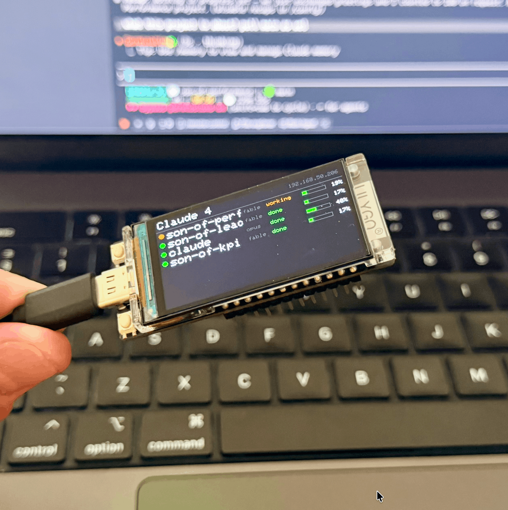

# Claude Code Status Display

A small screen for your desk that shows what Claude Code is doing. It tracks all your sessions at the same time, one row per terminal tab. Each row shows the status (working, done, or needs you), how full the context window is, and which model the session uses. When a session changes state, the screen flashes a colored circle so you notice it even when you are looking at something else.

It runs on a LilyGO T-Display-S3 (ESP32-S3 with a 1.9 inch ST7789 screen, 320x170). Your computer sends updates to it over WiFi using Claude Code hooks. There is no cloud service and no background program to keep running.



```
  Claude Code sessions (your terminal tabs)
        |
        |  each hook sends a small JSON update over your WiFi
        v
  ESP32 T-Display-S3
    - HTTP server on port 80
    - keeps a table of sessions in memory
    - draws the dashboard
```

## Compatibility

The link between Claude Code and the board is a Claude Code hook. So it works with any Claude Code that runs on your own machine and reads `~/.claude/settings.json`.

| Surface | Works | Why |
|---|---|---|
| Terminal / CLI | Yes | Runs on your machine and fires hooks. |
| VS Code / JetBrains extension | Yes | Same local engine and `settings.json`. |
| Desktop app (Mac/Windows) | Yes | Runs locally and fires hooks. Tested and working. |
| Web app (claude.ai/code) | No | Runs on Anthropic servers, so the hook cannot run on your machine or reach a device on your network. |

Running several of these at once is fine. Every local session that fires hooks shows up, no matter which app started it.

## Features

- Tracks many sessions at once (up to 24), one row each. Sessions that need you are sorted to the top. If there are more sessions than fit, the extra ones are summed up in a footer like `+13 more: 5 work, 6 done, 2 idle`.
- Each row is labelled by its project folder. If two sessions share a folder, they get `#1` and `#2`.
- Status colors: gray for ready, amber for working, green for done, red (blinking) for needs you.
- A context bar and percentage per session. It goes green, then amber, then red as the window fills.
- The model name per session (opus, fable, and so on).
- On any state change the screen shows a big blinking circle in that color, with the session name, for about one second.
- Long folder names scroll left and right so you can read them. They pause for 5 seconds first.
- The 60 second "waiting for your input" nudge from Claude is ignored, so a finished session stays green instead of turning red on its own.
- The display is set in one file (`src/display_config.h`): driver, bus, pins, and resolution. The layout adjusts to the screen size. It ships set up for the T-Display-S3 and can be changed for other ESP32 boards with an ST7789 or ILI9341 screen.

## Hardware

| You need | Notes |
|---|---|
| LilyGO T-Display-S3 | ESP32-S3, 1.9 inch ST7789 IPS, 320x170. The non-touch version is fine. |
| USB-C cable | For flashing, and for power if you want. |
| Power | After flashing you can run it from any USB charger or power bank, or a LiPo battery on the JST connector. The USB cable only carries power and flashing. All data goes over WiFi. |
| 2.4 GHz WiFi | The ESP32-S3 radio only works on 2.4 GHz. Your computer can be on 5 GHz as long as it is on the same router. |

Does it work on any ESP32? Not by itself. The display driver, bus, and pins are set when you build the firmware, not at runtime. But they all live in one file (`src/display_config.h`). Set your bus, driver, pins, and resolution, flash again, and the layout adjusts to the new screen. See [Porting](#porting-to-other-boards).

## Software

- PlatformIO (the VS Code extension or the `pio` command line).
- `jq` and `curl` on the computer that runs Claude Code (macOS or Linux). `curl` is already installed. Install `jq` with `brew install jq` or `apt install jq`.
- Claude Code.

PlatformIO downloads Arduino_GFX and ArduinoJson for you. You do not install them by hand.

## Setup

### 1. Flash the firmware

```bash
git clone <your-repo-url> claude-code-status-display
cd claude-code-status-display
cp src/secrets.h.example src/secrets.h
```

Put your 2.4 GHz WiFi name and password in `src/secrets.h`. This file is git-ignored, so it is never committed.

```c
#define WIFI_SSID "your-network"
#define WIFI_PASS "your-password"
```

Plug in the board and flash:

```bash
pio run -e claude_display -t upload
```

If upload fails with `Invalid head of packet` or a serial sync error, put the board in bootloader mode: hold BOOT, tap RST, release BOOT, then run upload again. Also close any serial monitor that is holding the port.

Open the serial monitor to see the IP it gets:

```bash
pio device monitor -b 115200
```

You should see a line like `WiFi: 192.168.x.y`. The board also announces itself as `claude-display.local` over mDNS. Check that it answers:

```bash
curl http://claude-display.local/      # or  curl http://192.168.x.y/
# -> claude-display ok
```

### 2. Install the hook script

```bash
mkdir -p ~/.claude/hooks
cp hooks/claude-display.sh ~/.claude/hooks/
chmod +x ~/.claude/hooks/claude-display.sh
```

Open `~/.claude/hooks/claude-display.sh` and set `BOARD`. Keep the `claude-display.local` default if mDNS worked above. Otherwise use the IP:

```sh
BOARD="http://192.168.x.y"
```

### 3. Wire up Claude Code hooks

Add these five events to `~/.claude/settings.json`. If you already have a `hooks` block, add to it instead of replacing it. Use the full path, because Claude Code does not expand `~`.

```json
{
  "hooks": {
    "SessionStart":     [{ "hooks": [{ "type": "command", "command": "/Users/YOU/.claude/hooks/claude-display.sh", "async": true }] }],
    "UserPromptSubmit": [{ "hooks": [{ "type": "command", "command": "/Users/YOU/.claude/hooks/claude-display.sh", "async": true }] }],
    "PostToolUse":      [{ "hooks": [{ "type": "command", "command": "/Users/YOU/.claude/hooks/claude-display.sh", "async": true }] }],
    "Notification":     [{ "hooks": [{ "type": "command", "command": "/Users/YOU/.claude/hooks/claude-display.sh", "async": true }] }],
    "Stop":             [{ "hooks": [{ "type": "command", "command": "/Users/YOU/.claude/hooks/claude-display.sh", "async": true }] }],
    "SessionEnd":       [{ "hooks": [{ "type": "command", "command": "/Users/YOU/.claude/hooks/claude-display.sh", "async": true }] }]
  }
}
```

Check the file is still valid JSON: `jq . ~/.claude/settings.json >/dev/null && echo OK`

### 4. Test

Hooks load when a session starts, so open a new terminal tab and run `claude`. A row should appear with the folder name and move from working to done as you go. You can also send a fake event by hand:

```bash
curl -s http://claude-display.local/event -H 'Content-Type: application/json' \
  -d '{"event":"Stop","session_id":"t1","cwd":"/x/demo","label":"demo","ctx":42,"model":"opus"}'
```

## Status reference

| Claude Code hook | Row status | Color |
|---|---|---|
| `SessionStart` | ready | gray |
| `UserPromptSubmit` | working | amber |
| `PostToolUse` (a tool ran) | working | amber |
| `Stop` | done | green |
| `Notification` (permission or attention) | needs you | red, blinking, top |
| `Notification` (60s idle nudge) | ignored | none |
| `SessionEnd` | row removed | none |

`PostToolUse` is what keeps a busy session marked "working". It also clears a "needs you" once you approve a permission prompt and Claude runs the next tool. Long-running or agent sessions can go a long time without a `Stop`, so without this they would get stuck on their last state. Tool activity from subagents carries the parent session id, so it updates the right row.

## Configuration

Display hardware is set in `src/display_config.h`. That is the file you edit for a different board:

- Bus: `BUS_PARALLEL8` or `BUS_SPI`.
- Driver: `DRIVER_ST7789` or `DRIVER_ILI9341`.
- Geometry: `TFT_WIDTH`, `TFT_HEIGHT`, `TFT_ROTATION`, `TFT_IPS`, and the offsets.
- Pins: `PIN_RST`, `PIN_BL`, `PIN_PWR` (use `-1` if the board does not have one), and the bus pins.

The layout adjusts to the resolution. The number of rows comes from the screen height. The model, status, and context columns sit on the right, and the name fills the rest. Very narrow screens (under about 250px wide) will be tight, because the font is a fixed size.

Behaviour is set at the top of `src/main.ino`:

- Colors: `C_READY`, `C_WORKING`, `C_NEEDS`, `C_DONE` (RGB565).
- Rows and capacity: `ROW_H`, `MAX_SESSIONS`.
- Flash: `FLASH_MS` (how long the circle shows).
- Marquee: `HOLD_L` and `HOLD_R` (pauses at each end) and the `* 25` / `/ 25` scroll speed in `drawMarqueeLabel`.

Host settings are in `hooks/claude-display.sh`:

- `BOARD`: the board address (hostname or IP).
- Context window: it is guessed as 200k, or 1M once a turn goes over 200k. Claude Code does not tell the hook the real window size. If you always use one size (for example a `[1m]` model), set `win` directly.

## Porting to other boards

Everything except the display works on any ESP32. To port, edit `src/display_config.h` and flash again:

1. Pick the bus (`BUS_PARALLEL8` or `BUS_SPI`) and driver (`DRIVER_ST7789` or `DRIVER_ILI9341`).
2. Set the pins for your wiring and the geometry (`TFT_WIDTH`, `TFT_HEIGHT`, `TFT_ROTATION`, offsets).
3. If your board is not an ESP32-S3 dev variant, change `board` in `platformio.ini`.

The layout re-flows to the new resolution on its own. To add a driver or bus that is not listed (for example ST7735, SSD1306, or software SPI), add one `#elif` branch to the bus and driver `#if` blocks in `src/main.ino`. That is the only code that touches the panel type.

### Example: generic ESP32 with SPI ILI9341 (240x320)

A common 2.4 or 2.8 inch ILI9341 screen on a classic ESP32 board. Set these in `src/display_config.h` (the SPI pins go in the `#ifdef BUS_SPI` block):

```c
// #define BUS_PARALLEL8
#define BUS_SPI                 // select SPI

// #define DRIVER_ST7789
#define DRIVER_ILI9341          // select ILI9341

// ILI9341 is fixed 240x320; rotation 1 = 320x240 landscape
#define TFT_WIDTH      240
#define TFT_HEIGHT     320
#define TFT_ROTATION   1
#define TFT_IPS        false
#define TFT_COL_OFFSET 0
#define TFT_ROW_OFFSET 0

#define PIN_RST 4
#define PIN_BL  32              // backlight GPIO (or wire LED to 3V3 and use -1)
#define PIN_PWR -1              // no separate panel-power pin

// inside the #ifdef BUS_SPI block, classic ESP32 VSPI pins:
#define PIN_DC   2
#define PIN_CS   15
#define PIN_SCK  18
#define PIN_MOSI 23
#define PIN_MISO 19
```

Then change `platformio.ini` to a plain ESP32 and remove the ESP32-S3 USB flags:

```ini
board = esp32dev
build_flags =
    -DDISABLE_ALL_LIBRARY_WARNINGS
```

Wiring: panel VCC to 3V3, GND to GND, LED to `PIN_BL` (or 3V3), and SDI/MOSI, SCK, CS, DC, RESET, SDO/MISO to the pins above. The exact GPIOs depend on your wiring. These are common defaults.

## Troubleshooting

- Upload fails with `Invalid head of packet`: put the board in bootloader mode (hold BOOT, tap RST, release BOOT), and close any serial monitor first.
- `claude-display.local` does not resolve: mDNS does not work on some networks. Use the board IP in `BOARD`. Set a DHCP reservation on your router so the IP stays the same when it runs on its own.
- Serial shows `WiFi: FAILED`: the network must be 2.4 GHz. Check the name and password. A special character in the password can break the C string. WPA3-only routers may need WPA2/WPA3 mixed mode.
- Nothing shows on the board: check the board answers (`curl http://<board>/`), that you started a new session after adding the hooks, and that `jq` is installed.

## Credits

- Board and hardware: [LilyGO T-Display-S3](https://github.com/Xinyuan-LilyGO/T-Display-S3).
- Graphics: [Arduino_GFX](https://github.com/moononournation/Arduino_GFX) by moononournation.
- JSON parsing: [ArduinoJson](https://arduinojson.org/) by Benoît Blanchon.

## License

MIT. See [LICENSE](LICENSE).
